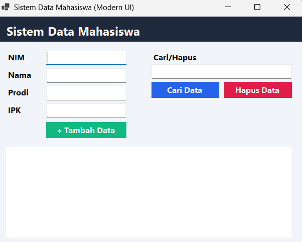

# Tugas Pemrograman Berbasis Kerangka Kerja (PBKK) W2

**Identitas Mahasiswa:**
* **Nama:** Achmad Najwa
* **NIM:** 5025231265
* **Departemen:** Teknik Informatika

---

## 1. Landasan Teori: Keunggulan Aplikasi Desktop

Meskipun aplikasi berbasis web dan seluler berkembang pesat, aplikasi desktop tetap menjadi pilihan utama untuk berbagai skenario kerja tertentu karena keunggulan berikut:
* **Efisiensi & Performa:** Eksekusi komputasi berat dan logika kompleks di sisi klien (*client-side*) berjalan jauh lebih cepat tanpa overhead latensi jaringan.
* **Integrasi Sistem & Hardware Lokal:** Akses langsung ke komponen perangkat keras (port serial, file system lokal, printer, periferal) tanpa restriksi izin browser atau hambatan firewall jaringan.
* **Manajemen Threading Efisien:** Pemanfaatan multithreading untuk tugas asinkron berjalan optimal langsung di atas manajemen thread sistem operasi lokal.
* **Kemudahan Pengembangan & Debugging:** Antarmuka Windows Forms didukung alat pelacakan galat (*debugging*) yang matang dan stabil.

---

## 2. HelloWorld!

### Langkah Pengerjaan

Jalankan code berikut secara berurutan pada terminal:
```powershell
dotnet new console -n HelloWorld
cd HelloWorld
dotnet run
```

### Dokumentasi Hasil Run


---

## 3. Sistem Data Mahasiswa (Console Application)

### Langkah Pengerjaan

Jalankan code berikut secara berurutan pada terminal:
```powershell
dotnet new console -n DataMahasiswa
cd DataMahasiswa
code .
```

Buka File `Program.cs` dan isi dengan code berikut:
```csharp
using System;
using System.Collections.Generic;

namespace DataMahasiswa
{
    class Mahasiswa
    {
        public string NIM { get; set; }
        public string Nama { get; set; }
        public string Prodi { get; set; }
        public double IPK { get; set; }

        public Mahasiswa(string nim, string nama, string prodi, double ipk)
        {
            NIM = nim;
            Nama = nama;
            Prodi = prodi;
            IPK = ipk;
        }
    }

    class Program
    {
        static List<Mahasiswa> daftarMahasiswa = new List<Mahasiswa>();

        static void Main(string[] args)
        {
            int pilihan;
            do
            {
                TampilkanMenu();
                Console.Write("Pilihan: ");
                string input = Console.ReadLine() ?? string.Empty;
                if (!int.TryParse(input, out pilihan)) pilihan = 0;
                Console.WriteLine();

                switch (pilihan)
                {
                    case 1: TambahMahasiswa(); break;
                    case 2: TampilkanMahasiswa(); break;
                    case 3: CariMahasiswa(); break;
                    case 4: HapusMahasiswa(); break;
                    case 5: Console.WriteLine("Terima kasih telah menggunakan program."); break;
                    default: Console.WriteLine("Pilihan tidak tersedia!"); break;
                }

                if (pilihan != 5)
                {
                    Console.WriteLine("\nTekan ENTER untuk melanjutkan...");
                    Console.ReadLine();
                }
            } while (pilihan != 5);
        }

        static void TampilkanMenu()
        {
            Console.Clear();
            Console.WriteLine("========================================");
            Console.WriteLine(" SISTEM DATA MAHASISWA");
            Console.WriteLine("========================================");
            Console.WriteLine("1. Tambah Mahasiswa\n2. Tampilkan Mahasiswa\n3. Cari Mahasiswa\n4. Hapus Mahasiswa\n5. Keluar");
            Console.WriteLine("========================================");
        }

        static void TambahMahasiswa()
        {
            Console.Clear();
            Console.WriteLine("========================================");
            Console.WriteLine(" TAMBAH MAHASISWA");
            Console.WriteLine("========================================");
            Console.Write("NIM : "); string nim = Console.ReadLine() ?? string.Empty;
            Console.Write("Nama : "); string nama = Console.ReadLine() ?? string.Empty;
            Console.Write("Program Studi: "); string prodi = Console.ReadLine() ?? string.Empty;

            double ipk;
            while (true)
            {
                Console.Write("IPK: ");
                if (double.TryParse(Console.ReadLine(), out ipk) && ipk >= 0 && ipk <= 4) break;
                Console.WriteLine("IPK harus berupa angka 0-4.");
            }

            daftarMahasiswa.Add(new Mahasiswa(nim, nama, prodi, ipk));
            Console.WriteLine("\nData mahasiswa berhasil ditambahkan.");
        }

        static void TampilkanMahasiswa()
        {
            Console.Clear();
            Console.WriteLine("========================================");
            Console.WriteLine(" DAFTAR MAHASISWA");
            Console.WriteLine("========================================");
            if (daftarMahasiswa.Count == 0)
            {
                Console.WriteLine("Belum ada data mahasiswa.");
                return;
            }
            Console.WriteLine("{0,-12} {1,-20} {2,-20} {3,5}", "NIM", "Nama", "Prodi", "IPK");
            Console.WriteLine("------------------------------------------------------------");
            foreach (Mahasiswa m in daftarMahasiswa)
            {
                Console.WriteLine("{0,-12} {1,-20} {2,-20} {3,5:F2}", m.NIM, m.Nama, m.Prodi, m.IPK);
            }
        }

        static void CariMahasiswa()
        {
            Console.Clear();
            Console.WriteLine("========================================");
            Console.WriteLine(" CARI MAHASISWA");
            Console.WriteLine("========================================");
            Console.Write("Masukkan NIM: "); string nimCari = Console.ReadLine() ?? string.Empty;
            var m = daftarMahasiswa.Find(x => x.NIM.Equals(nimCari, StringComparison.OrdinalIgnoreCase));
            Console.WriteLine();
            if (m != null)
                Console.WriteLine($"Data ditemukan!\nNIM: {m.NIM}\nNama: {m.Nama}\nProdi: {m.Prodi}\nIPK: {m.IPK:F2}");
            else
                Console.WriteLine("Mahasiswa dengan NIM tersebut tidak ditemukan.");
        }

        static void HapusMahasiswa()
        {
            Console.Clear();
            Console.WriteLine("========================================");
            Console.WriteLine(" HAPUS MAHASISWA");
            Console.WriteLine("========================================");
            Console.Write("Masukkan NIM: "); string nimHapus = Console.ReadLine() ?? string.Empty;
            var m = daftarMahasiswa.Find(x => x.NIM.Equals(nimHapus, StringComparison.OrdinalIgnoreCase));
            if (m != null)
            {
                daftarMahasiswa.Remove(m);
                Console.WriteLine("\nData mahasiswa berhasil dihapus.");
            }
            else Console.WriteLine("\nData mahasiswa tidak ditemukan.");
        }
    }
}
```

Save (ctrl + s) dan run dengan:
```powershell
dotnet run
```

### Dokumentasi Hasil Run


### Dokumentasi Tambah Data Mahasiswa 1


### Dokumentasi Tambah Data Mahasiswa 2


### Dokumentasi Tampilkan Data


### Dokumentasi Cari Data (berhasil)


### Dokumentasi Cari Data (gagal)


### Dokumentasi Hapus Data (berhasil)


### Dokumentasi Data Setelah Dihapus


---

## 4. Sistem Data Mahasiswa (UI)

Pada bagian ini, aplikasi Sistem Data Mahasiswa yang sebelumnya berbasis Console Application dikembangkan lebih lanjut dengan menambahkan antarmuka berbasis grafis (GUI) menggunakan Windows Forms (WinForms) di .NET framework.

### Langkah Pengerjaan

Jalankan code berikut satu-persatu pada terminal:
```powershell
dotnet new winforms -n DataMahasiswaUI
cd DataMahasiswaUI
code .
```

Kemudian buka file `Form1.Designer.cs` lalu isi dengan code berikut:
```csharp
namespace DataMahasiswaUI
{
    partial class Form1
    {
        private System.ComponentModel.IContainer components = null;
        private System.Windows.Forms.TextBox txtNIM, txtNama, txtProdi, txtIPK, txtCariNIM;
        private System.Windows.Forms.Button btnTambah, btnCari, btnHapus;
        private System.Windows.Forms.DataGridView dgvMahasiswa;
        private System.Windows.Forms.Label lblNIM, lblNama, lblProdi, lblIPK, lblCari, lblTitle;
        private System.Windows.Forms.Panel panelHeader;

        protected override void Dispose(bool disposing)
        {
            if (disposing && (components != null)) components.Dispose();
            base.Dispose(disposing);
        }

        private void InitializeComponent()
        {
            this.panelHeader = new System.Windows.Forms.Panel();
            this.lblTitle = new System.Windows.Forms.Label();
            this.lblNIM = new System.Windows.Forms.Label();
            this.lblNama = new System.Windows.Forms.Label();
            this.lblProdi = new System.Windows.Forms.Label();
            this.lblIPK = new System.Windows.Forms.Label();
            this.lblCari = new System.Windows.Forms.Label();
            this.txtNIM = new System.Windows.Forms.TextBox();
            this.txtNama = new System.Windows.Forms.TextBox();
            this.txtProdi = new System.Windows.Forms.TextBox();
            this.txtIPK = new System.Windows.Forms.TextBox();
            this.txtCariNIM = new System.Windows.Forms.TextBox();
            this.btnTambah = new System.Windows.Forms.Button();
            this.btnCari = new System.Windows.Forms.Button();
            this.btnHapus = new System.Windows.Forms.Button();
            this.dgvMahasiswa = new System.Windows.Forms.DataGridView();

            this.panelHeader.SuspendLayout();
            ((System.ComponentModel.ISupportInitialize)(this.dgvMahasiswa)).BeginInit();
            this.SuspendLayout();

            var fontLabel = new System.Drawing.Font("Segoe UI", 9.5F, System.Drawing.FontStyle.Bold);
            var fontInput = new System.Drawing.Font("Segoe UI", 9.5F);

            this.panelHeader.BackColor = System.Drawing.Color.FromArgb(30, 41, 59);
            this.panelHeader.Controls.Add(this.lblTitle);
            this.panelHeader.Dock = System.Windows.Forms.DockStyle.Top;
            this.panelHeader.Size = new System.Drawing.Size(620, 50);

            this.lblTitle.AutoSize = true;
            this.lblTitle.Font = new System.Drawing.Font("Segoe UI", 14F, System.Drawing.FontStyle.Bold);
            this.lblTitle.ForeColor = System.Drawing.Color.White;
            this.lblTitle.Location = new System.Drawing.Point(15, 12);
            this.lblTitle.Text = "Sistem Data Mahasiswa";

            this.lblNIM.Text = "NIM"; this.lblNIM.Font = fontLabel; this.lblNIM.Location = new System.Drawing.Point(20, 70); this.lblNIM.Size = new System.Drawing.Size(80, 20);
            this.txtNIM.Font = fontInput; this.txtNIM.Location = new System.Drawing.Point(100, 68); this.txtNIM.Size = new System.Drawing.Size(160, 25);

            this.lblNama.Text = "Nama"; this.lblNama.Font = fontLabel; this.lblNama.Location = new System.Drawing.Point(20, 105); this.lblNama.Size = new System.Drawing.Size(80, 20);
            this.txtNama.Font = fontInput; this.txtNama.Location = new System.Drawing.Point(100, 103); this.txtNama.Size = new System.Drawing.Size(160, 25);

            this.lblProdi.Text = "Prodi"; this.lblProdi.Font = fontLabel; this.lblProdi.Location = new System.Drawing.Point(20, 140); this.lblProdi.Size = new System.Drawing.Size(80, 20);
            this.txtProdi.Font = fontInput; this.txtProdi.Location = new System.Drawing.Point(100, 138); this.txtProdi.Size = new System.Drawing.Size(160, 25);

            this.lblIPK.Text = "IPK"; this.lblIPK.Font = fontLabel; this.lblIPK.Location = new System.Drawing.Point(20, 175); this.lblIPK.Size = new System.Drawing.Size(80, 20);
            this.txtIPK.Font = fontInput; this.txtIPK.Location = new System.Drawing.Point(100, 173); this.txtIPK.Size = new System.Drawing.Size(160, 25);

            this.btnTambah.Text = "+ Tambah Data"; this.btnTambah.Font = fontLabel; this.btnTambah.BackColor = System.Drawing.Color.FromArgb(16, 185, 129);
            this.btnTambah.ForeColor = System.Drawing.Color.White; this.btnTambah.FlatStyle = System.Windows.Forms.FlatStyle.Flat;
            this.btnTambah.Location = new System.Drawing.Point(100, 210); this.btnTambah.Size = new System.Drawing.Size(160, 32);
            this.btnTambah.Click += new System.EventHandler(this.btnTambah_Click);

            this.lblCari.Text = "Cari/Hapus NIM:"; this.lblCari.Font = fontLabel; this.lblCari.Location = new System.Drawing.Point(310, 70); this.lblCari.Size = new System.Drawing.Size(130, 20);
            this.txtCariNIM.Font = fontInput; this.txtCariNIM.Location = new System.Drawing.Point(310, 95); this.txtCariNIM.Size = new System.Drawing.Size(280, 25);

            this.btnCari.Text = "Cari Data"; this.btnCari.Font = fontLabel; this.btnCari.BackColor = System.Drawing.Color.FromArgb(37, 99, 235);
            this.btnCari.ForeColor = System.Drawing.Color.White; this.btnCari.FlatStyle = System.Windows.Forms.FlatStyle.Flat;
            this.btnCari.Location = new System.Drawing.Point(310, 130); this.btnCari.Size = new System.Drawing.Size(135, 32);
            this.btnCari.Click += new System.EventHandler(this.btnCari_Click);

            this.btnHapus.Text = "Hapus Data"; this.btnHapus.Font = fontLabel; this.btnHapus.BackColor = System.Drawing.Color.FromArgb(225, 29, 72);
            this.btnHapus.ForeColor = System.Drawing.Color.White; this.btnHapus.FlatStyle = System.Windows.Forms.FlatStyle.Flat;
            this.btnHapus.Location = new System.Drawing.Point(455, 130); this.btnHapus.Size = new System.Drawing.Size(135, 32);
            this.btnHapus.Click += new System.EventHandler(this.btnHapus_Click);

            this.dgvMahasiswa.BackgroundColor = System.Drawing.Color.White;
            this.dgvMahasiswa.Location = new System.Drawing.Point(20, 260);
            this.dgvMahasiswa.Size = new System.Drawing.Size(570, 180);

            this.ClientSize = new System.Drawing.Size(610, 460);
            this.BackColor = System.Drawing.Color.FromArgb(241, 245, 249);
            this.Controls.AddRange(new System.Windows.Forms.Control[] {
                this.panelHeader, this.lblNIM, this.txtNIM, this.lblNama, this.txtNama,
                this.lblProdi, this.txtProdi, this.lblIPK, this.txtIPK, this.btnTambah,
                this.lblCari, this.txtCariNIM, this.btnCari, this.btnHapus, this.dgvMahasiswa
            });
            this.Text = "Sistem Data Mahasiswa (Modern UI)";
            this.panelHeader.ResumeLayout(false);
            this.panelHeader.PerformLayout();
            ((System.ComponentModel.ISupportInitialize)(this.dgvMahasiswa)).EndInit();
            this.ResumeLayout(false);
            this.PerformLayout();
        }
    }
}
```

Kemudian buka file `Form1.cs` dan isi dengan code berikut:
```csharp
using System;
using System.Collections.Generic;
using System.Linq;
using System.Windows.Forms;

namespace DataMahasiswaUI
{
    public partial class Form1 : Form
    {
        public class Mahasiswa
        {
            public string NIM { get; set; }
            public string Nama { get; set; }
            public string Prodi { get; set; }
            public double IPK { get; set; }

            public Mahasiswa(string nim, string nama, string prodi, double ipk)
            {
                NIM = nim;
                Nama = nama;
                Prodi = prodi;
                IPK = ipk;
            }
        }

        private List<Mahasiswa> daftarMahasiswa = new List<Mahasiswa>();

        public Form1()
        {
            InitializeComponent();
        }

        private void RefreshTabel()
        {
            dgvMahasiswa.DataSource = null;
            dgvMahasiswa.DataSource = daftarMahasiswa;
        }

        private void btnTambah_Click(object sender, EventArgs e)
        {
            string nim = txtNIM.Text.Trim();
            string nama = txtNama.Text.Trim();
            string prodi = txtProdi.Text.Trim();

            if (string.IsNullOrEmpty(nim) || string.IsNullOrEmpty(nama) || string.IsNullOrEmpty(prodi))
            {
                MessageBox.Show("Semua kolom input harus diisi!", "Peringatan", MessageBoxButtons.OK, MessageBoxIcon.Warning);
                return;
            }

            if (double.TryParse(txtIPK.Text, out double ipk) && ipk >= 0 && ipk <= 4)
            {
                daftarMahasiswa.Add(new Mahasiswa(nim, nama, prodi, ipk));
                RefreshTabel();
                MessageBox.Show("Data mahasiswa berhasil ditambahkan!", "Sukses", MessageBoxButtons.OK, MessageBoxIcon.Information);
                
                txtNIM.Clear();
                txtNama.Clear();
                txtProdi.Clear();
                txtIPK.Clear();
            }
            else
            {
                MessageBox.Show("IPK harus berupa angka antara 0 - 4!", "Error IPK", MessageBoxButtons.OK, MessageBoxIcon.Error);
            }
        }

        private void btnCari_Click(object sender, EventArgs e)
        {
            string nimCari = txtCariNIM.Text.Trim();
            var mhs = daftarMahasiswa.FirstOrDefault(x => x.NIM.Equals(nimCari, StringComparison.OrdinalIgnoreCase));

            if (mhs != null)
            {
                MessageBox.Show($"Data Ditemukan!\n\nNIM: {mhs.NIM}\nNama: {mhs.Nama}\nProdi: {mhs.Prodi}\nIPK: {mhs.IPK:F2}", "Hasil Pencarian", MessageBoxButtons.OK, MessageBoxIcon.Information);
            }
            else
            {
                MessageBox.Show("Mahasiswa dengan NIM tersebut tidak ditemukan.", "Info", MessageBoxButtons.OK, MessageBoxIcon.Warning);
            }
        }

        private void btnHapus_Click(object sender, EventArgs e)
        {
            string nimHapus = txtCariNIM.Text.Trim();
            var mhs = daftarMahasiswa.FirstOrDefault(x => x.NIM.Equals(nimHapus, StringComparison.OrdinalIgnoreCase));

            if (mhs != null)
            {
                daftarMahasiswa.Remove(mhs);
                RefreshTabel();
                MessageBox.Show("Data mahasiswa berhasil dihapus!", "Sukses", MessageBoxButtons.OK, MessageBoxIcon.Information);
                txtCariNIM.Clear();
            }
            else
            {
                MessageBox.Show("Data tidak ditemukan!", "Error", MessageBoxButtons.OK, MessageBoxIcon.Error);
            }
        }
    }
}
```

Lalu run dengan code berikut:
```powershell
dotnet run
```

### Tampilan Run

